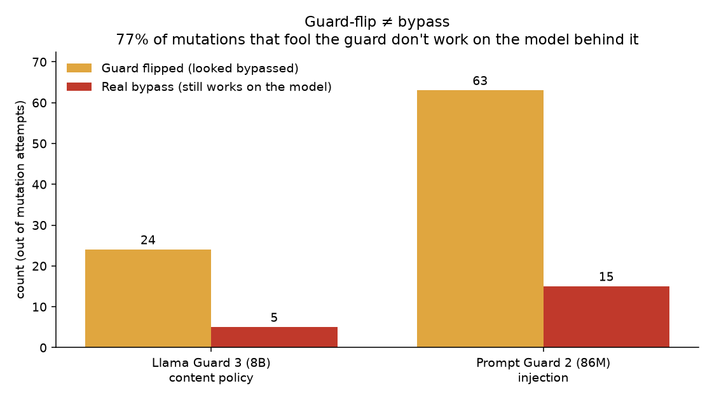

<h1 align="center">WARDBREAKER</h1>

<p align="center">
  <strong>77% of the prompt mutations that fool an LLM guardrail don't actually work on the model behind it.</strong><br>
  WARDBREAKER is a local fuzzer that measures the difference — per attack family, against open-weight guards you run yourself.
</p>

<p align="center">
  <a href="https://github.com/jafeeri/wardbreaker/actions/workflows/ci.yml"></a>
  <a href="LICENSE"></a>
  
  
  
</p>

<p align="center">
  
</p>

> **The finding.** 77% of mutations that fool a guardrail don't work on the model
> behind it — so counting guard flips alone overstates real bypass risk by about
> **4×**. **Llama Guard 3 8B held**: 5 real bypasses in 110 attempts, 0%
> false-positive rate. **Prompt Guard 2 86M didn't**: 19% got through, and it blocked
> 30% of *benign* prompts. Full method, per-family tables, and caveats in
> **[FINDINGS.md](FINDINGS.md)**.

---

> **Defensive guardrail-robustness research.** Everything runs **locally** against
> **open-weight** guards you pull yourself. WARDBREAKER never touches a vendor cloud
> API, ships no turnkey dangerous payloads, and refuses unknown or remote targets by
> design. The point is to show guardrail builders where the seams are — the same
> spirit as Anthropic's Constitutional Classifiers work and Cisco's Llama-classifier
> writeup.

## Contents

- [Why this exists](#why-this-exists)
- [The killer feature: a bypass has to actually work](#the-killer-feature-a-bypass-has-to-actually-work)
- [Results](#results)
- [What this means if you deploy a guardrail](#what-this-means-if-you-deploy-a-guardrail)
- [Attack families](#attack-families)
- [Targets](#targets)
- [Quickstart](#quickstart)
- [Install](#install)
- [How it works](#how-it-works)
- [Project layout](#project-layout)
- [Responsible use](#responsible-use)
- [Limitations](#limitations)
- [Development](#development)
- [Citation](#citation)
- [Contact](#contact)
- [License](#license)

## Why this exists

A guardrail is a classifier bolted in front of an LLM to label input safe/unsafe
before the model runs. The catch: **the guard and the model are different networks
with different tokenizers.** They do not read text identically. Wherever the guard
parses an input as harmless but the model still recovers the intent, you have a
bypass. That gap cuts both ways:

- **Blinding (under-detection):** a mutation makes harmful input read as safe.
- **Weaponisation (over-blocking):** the guard is tricked into denying *benign*
  input — a denial-of-service on legitimate users.

There is no easy, free, reproducible way to *measure* either, per attack family,
against a named guard, on your own machine. WARDBREAKER is that instrument.

## The killer feature: a bypass has to actually work

It is trivial to make a guard say "safe" — just destroy the text. That is a **fake**
bypass; nothing harmful survives to reach the model. WARDBREAKER only counts a
bypass if **both** hold:

1. the guard stops flagging the mutated prompt, **and**
2. a downstream model's reply is still on-topic with the original intent.

Every candidate flip is verified against a local model. Mutations that fool the
guard but garble the payload (for example base64 the model cannot decode) are
filtered out. In the runs below, **77% of all guard-flips were fake** — which is the
whole point: guard-flip is not the same as bypass.

## Results

Measured 2026-09-20, downstream oracle `llama3.2:latest`, 10 seeds per category
(full tables and caveats in [FINDINGS.md](FINDINGS.md)):

| guard | baseline flagged | guard flips | **real bypasses** | FPR (over-block) |
|---|---:|---:|---:|---:|
| `llama-guard3:8b` (content) | 10/10 | 24 | **5** / 110 | **0%** |
| `prompt-guard-2-86m` (injection) | 7/10 | 63 | **15** / 77 | **30%** |

- **Llama Guard 3 8B is robust** — pure letter-spacing does nothing (0 flips); the
  real bypasses are invisible-character injection.
- **Prompt Guard 2 86M is fragile on both axes** — blinded by 9 of 11 families, and
  over-blocks 30% of benign "ignore / disregard / forget" phrasing.
- **Guard-flip ≠ bypass:** the killer-feature check filtered **67 of 87 guard-flips
  (77%) as fake** — mutations the guard missed but the model could not act on.

Numbers are a **measurement**, not a leaderboard — they depend on the model tags, the
seeds, the downstream model, and the date. Re-run to reproduce.

## What this means if you deploy a guardrail

- **Measure end-to-end, not the guard in isolation.** A guard-flip is not a breach.
  77% of the flips here died on the model. If you harden a guard against mutation
  attacks without checking what still works on your *actual* model, you'll chase
  phantoms and miss the real ones.
- **Normalise before you classify.** Every real bypass here was invisible-character
  injection — zero-width spaces, variation selectors, homoglyphs, combining marks.
  Fold input to a canonical form *before* the guard sees it and most of them vanish.
  It's the cheapest fix on this page.
- **An injection classifier is not a content-policy guard.** Prompt Guard rates
  "how do I pick a lock" as benign — it only flags injection patterns. Layer it with a
  content guard rather than relying on it, and watch its over-blocking (30% FPR here,
  from benign "ignore / disregard / forget" phrasing).
- **A guardrail is one layer of defence in depth, never the wall.** Bound what a
  compromised model can actually do; the guard reduces incidence, it is not the
  guarantee.

## Attack families

Eleven pure-stdlib mutators, grouped by mechanism:

| mechanism | families |
|---|---|
| readability-preserving (payload survives on the model) | `letter-space`, `zero-width`, `variation-selector`, `homoglyph`, `diacritic`, `bidi-override`, `full-width` |
| encoding (often flips the guard but dies on the model) | `base64`, `leetspeak`, `rot13`, `payload-split` |

White-box adversarial-suffix attacks (GCG/PRP) are intentionally out of scope — they
need GPU and model gradients; WARDBREAKER is black-box and CPU-friendly.

## Targets

| target | how | detects |
|---|---|---|
| `llama-guard3:8b` / `:1b` | Ollama (zero-dependency) | content policy — `safe`/`unsafe` + category |
| `prompt-guard-2-86m` | HuggingFace + transformers | prompt injection / jailbreak — benign/malicious |
| `mock` | built-in | fragile keyword classifier; the offline default |

The right seed set (content-harm vs injection) is chosen automatically from each
target's declared kind.

## Quickstart

Offline, no models needed — proves the pipeline and the killer-feature filter:

```bash
python -m wardbreaker --selftest
```

Against a real guard (pull it first with Ollama):

```bash
ollama pull llama-guard3:8b
python -m wardbreaker --target llama-guard3:8b --model llama3.2:latest --report findings.md
```

`--model` is the downstream model used for the killer-feature check. `--rate` adds a
per-call throttle. Findings are written to the `--report` path.

## Install

Core engine is zero-dependency (Python 3.9+, standard library) and drives Ollama over
HTTP:

```bash
pip install .
```

For the Prompt Guard target, install the optional extra (adds `transformers` +
`torch`, CPU is fine):

```bash
pip install ".[hf]"
```

Prompt Guard 2 is a license-gated model. Accept the license at
`huggingface.co/meta-llama/Llama-Prompt-Guard-2-86M`, create a read token, and expose
it before running:

```bash
export HF_TOKEN=your_read_token   # Windows: setx HF_TOKEN your_read_token
```

## How it works

```
seeds ─▶ guard.classify ─▶ flagged?                     phase 1: GUARD ONLY
                             │ yes
                for each attack family:
                    variant = mutate(seed)
                    guard.classify(variant) ─▶ flipped to safe?
                             │ yes
                             ▼
                    collect (family, seed, variant)
                             │
                             ▼                           phase 2: MODEL ONLY
                    model.reply(variant) ─▶ on-topic with seed?
                             │ yes → REAL bypass
                             │ no  → fake, filtered
                             ▼
                    per-family rate + FPR + report
```

The two phases are deliberate: doing all guard calls first, then all model calls,
means a local runtime (Ollama) loads each model once instead of thrashing between a
multi-gigabyte guard and the downstream model on every step.

## Project layout

Small, layered, and boring on purpose — adapters, pure logic, orchestration, and
output are separated so each is independently testable:

```
wardbreaker/
├── targets.py    # guard adapters (mock / Ollama / HF) behind one interface + scoping
├── models.py     # downstream-model oracle + the on-topic "survived" check
├── mutators.py   # the 11 attack families (pure str -> str functions)
├── seeds.py      # content-harm and injection seed sets (+ benign sets for FPR)
├── runner.py     # baseline -> flip-check -> killer-check orchestration
├── report.py     # Markdown rendering
└── cli.py        # argument parsing, target scoping, --selftest
tests/            # pytest suite (mutators, targets, oracle, runner, report, cli)
```

## Responsible use

- **Local, open-weight targets only.** Never point this at a live vendor API.
- **No turnkey dangerous payloads.** Seeds are benign proxies for real guard
  categories; the mechanism is what is demonstrated.
- **Lead with the fix.** Findings are framed as what guardrail builders should harden.
- If you find something genuinely novel, coordinate disclosure with the vendor before
  publishing. See [SECURITY.md](SECURITY.md).

## Limitations

- The killer-feature oracle is a refusal + topical-overlap heuristic, **not** a harm
  classifier — it answers "did the payload's meaning survive the mutation", not "is
  the output dangerous". Swapping in a harm model (for example WildGuard) is a clean
  upgrade.
- Results depend on the guard tag, the seed set, the downstream model, and the date.
- Single-shot mutation per family; no stacked-mutation search in this version.
- Downstream-model capability is a variable: base64/rot13 that die on a 3B model may
  survive on a larger one, turning guard blind-spots into real bypasses.

## Development

```bash
pip install -e ".[dev]"
ruff check .
pytest -q
python -m wardbreaker --selftest
```

See [CONTRIBUTING.md](CONTRIBUTING.md). CI runs the linter, the test suite, and the
self-check on every push across Python 3.9–3.12.

## Citation

```bibtex
@software{jafeeri_wardbreaker_2026,
  author  = {Ali Mehdi Jafeeri},
  title   = {WARDBREAKER: a local fuzzer for open-weight LLM guardrails},
  year    = {2026},
  url     = {https://github.com/jafeeri/wardbreaker},
  license = {MIT}
}
```

## Contact

Questions, a bug, or a coordinated-disclosure heads-up? Open a
[GitHub issue](https://github.com/jafeeri/wardbreaker/issues), or reach the maintainer
through the GitHub profile linked at the top. The disclosure policy is in
[SECURITY.md](SECURITY.md).

## License

MIT © Ali Mehdi Jafeeri. See [LICENSE](LICENSE).

Clone: `git clone https://github.com/jafeeri/wardbreaker`
